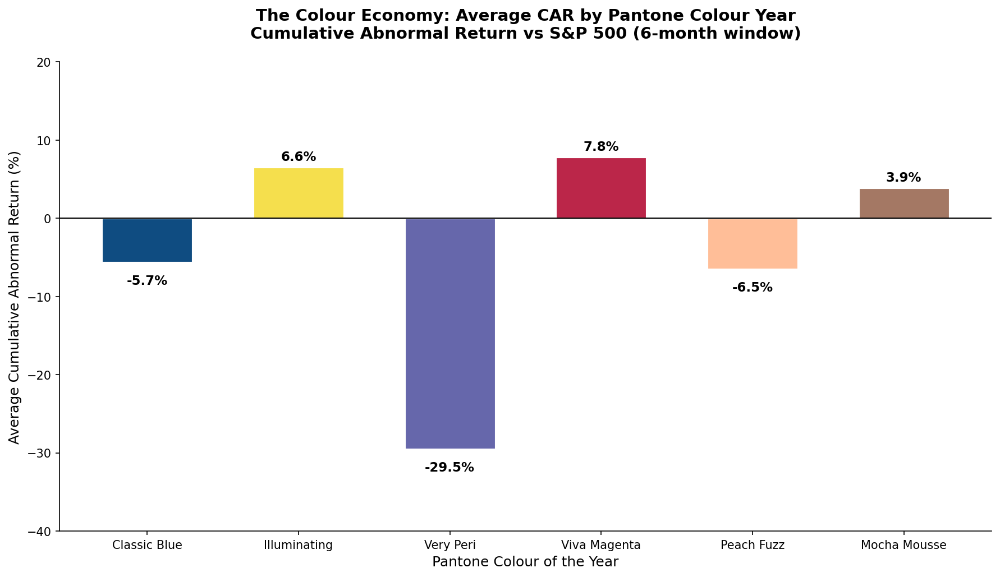
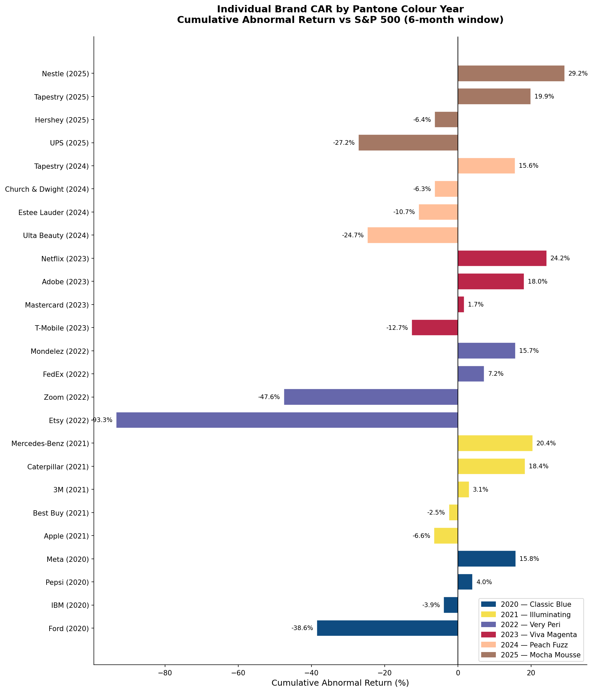
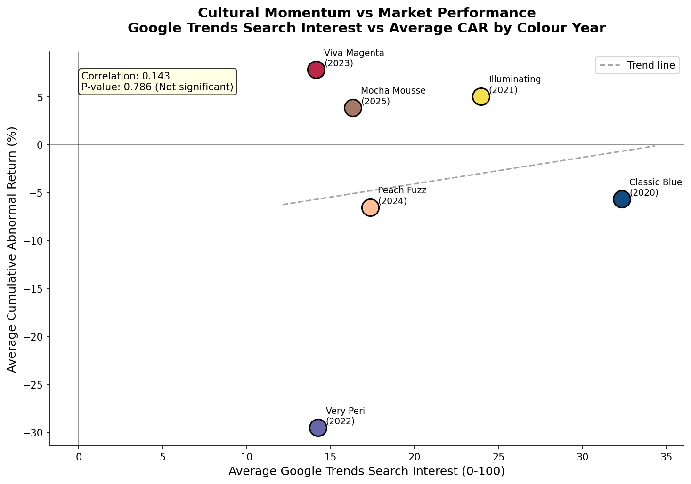
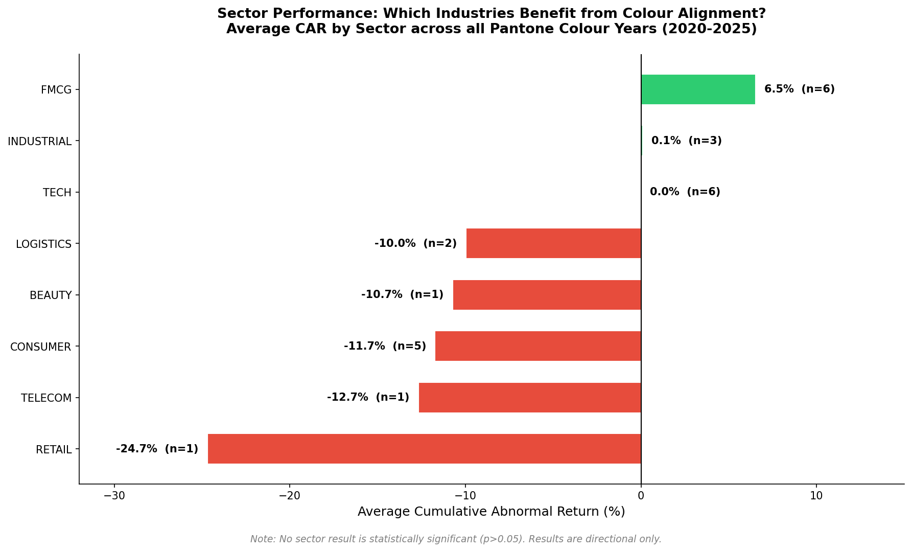

# The Colour Economy
## Does Pantone Create Shareholder Value for Colour-Aligned Brands?


---

## Overview

Every December, Pantone announces its Colour of the Year — a single shade 
that shapes product pipelines, retail buying decisions and brand campaigns 
across a $380 billion global industry. This study applies rigorous financial 
event-study methodology to test whether publicly listed companies whose brand 
identity is permanently anchored in that colour generate measurable abnormal 
stock returns relative to the S&P 500.
 
**Time Period:** 2020–2025  
**Sample:** 25 permanent colour-identity brands + 5 activation cases  
**Sectors:** FMCG, Tech, Consumer, Industrial, Logistics, Beauty, Retail, Telecom

---

## Research Design

### Two-Tier Study

**Tier 1 — Permanent Colour Identity**
Companies whose brand colour permanently matches the Pantone Colour of the Year.
Measurement window: 6 months post-announcement.

**Tier 2 — Active Colour Adoption**
Companies that launched specific products in the Pantone colour that year.
Measurement window: 3 months post-activation.

### Hypotheses

| Hypothesis | Question | Result |
|------------|----------|--------|
| H1 | Do colour-aligned brands outperform the S&P 500? | Not supported |
| H2 | Does Google Trends search volume predict CAR? | Not supported |
| H3 | Does active colour adoption create a stock price effect? | Inconclusive |

---

## Key Findings

### H1 — Colour Alignment Does Not Predict Outperformance
Average CAR across all 25 brands: **-3.49%** (p=0.526, not significant).
Markets are indifferent to cultural colour signals — even in unambiguous 
cases like T-Mobile, whose magenta is legally trademarked, underperforming 
by 12.7% after Viva Magenta 2023.

### H2 — Cultural Momentum Does Not Predict Returns
Google Trends correlation with CAR: **r=0.143** (p=0.786, not significant).
Public enthusiasm for a colour operates independently of its financial 
consequences for colour-aligned brands.

### H3 — Activation Results Are Mixed
Levi Strauss: **+13.04%** following Viva Magenta campaign.
Motorola Solutions: consistently flat or negative across three colour years.
Insufficient sample size (n=4) for statistical conclusion.

### Sector Finding — The Most Interesting Result
| Sector | Average CAR | Sample |
|--------|-------------|--------|
| FMCG | +6.5% | n=6 |
| Industrial | +0.1% | n=3 |
| Tech | 0.0% | n=6 |
| Logistics | -10.0% | n=2 |
| Beauty | -10.7% | n=1 |
| Consumer | -11.7% | n=5 |
| Telecom | -12.7% | n=1 |
| Retail | -24.7% | n=1 |

Sector mediates the colour effect more powerfully than the colour itself.
FMCG brands with stable, defensive business models appear better positioned 
to benefit from cultural colour tailwinds than trend-sensitive consumer brands.

---

## Visualisations

### Average CAR by Pantone Colour Year


### Individual Brand Performance


### Google Trends vs CAR


### Sector Performance


---

## Methodology

| Component | Detail |
|-----------|--------|
| Methodology | Financial event study, CAR framework |
| Benchmark | S&P 500 (^GSPC) |
| Normal return | Market return (S&P 500 daily return) |
| Abnormal return | Stock return minus market return |
| CAR window | 180 days (Tier 1), 90 days (Tier 2) |
| Statistical tests | One-sample t-test, Pearson correlation |
| Cultural proxy | Google Trends search volume |
| Stock data | Yahoo Finance via yfinance |
| Trends data | Google Trends via pytrends |

---

## Brand Universe

### Tier 1 — Permanent Colour Identity

| Year | Colour | Brand | Ticker | Sector |
|------|--------|-------|--------|--------|
| 2020 | Classic Blue | IBM | IBM | Tech |
| 2020 | Classic Blue | Meta | META | Tech |
| 2020 | Classic Blue | Pepsi | PEP | FMCG |
| 2020 | Classic Blue | Ford | F | Industrial |
| 2021 | Ultimate Gray | Apple | AAPL | Tech |
| 2021 | Ultimate Gray | Mercedes-Benz | MBG.DE | Industrial |
| 2021 | Illuminating | 3M | MMM | FMCG |
| 2021 | Illuminating | Caterpillar | CAT | Industrial |
| 2021 | Both | Best Buy | BBY | Consumer |
| 2022 | Very Peri | FedEx | FDX | Logistics |
| 2022 | Very Peri | Mondelez | MDLZ | FMCG |
| 2022 | Very Peri | Zoom | ZM | Tech |
| 2022 | Very Peri | Etsy | ETSY | Consumer |
| 2023 | Viva Magenta | T-Mobile | TMUS | Telecom |
| 2023 | Viva Magenta | Mastercard | MA | Consumer |
| 2023 | Viva Magenta | Adobe | ADBE | Tech |
| 2023 | Viva Magenta | Netflix | NFLX | Tech |
| 2024 | Peach Fuzz | Estée Lauder | EL | Beauty |
| 2024 | Peach Fuzz | Tapestry | TPR | Consumer |
| 2024 | Peach Fuzz | Ulta Beauty | ULTA | Retail |
| 2024 | Peach Fuzz | Church & Dwight | CHD | FMCG |
| 2025 | Mocha Mousse | UPS | UPS | Logistics |
| 2025 | Mocha Mousse | Nestlé | NSRGY | FMCG |
| 2025 | Mocha Mousse | Hershey | HSY | FMCG |
| 2025 | Mocha Mousse | Tapestry | TPR | Consumer |

### Tier 2 — Active Colour Adoption

| Year | Colour | Brand | Ticker | Activation |
|------|--------|-------|--------|------------|
| 2020 | Classic Blue | Ford | F | Mach-E GT launch |
| 2023 | Viva Magenta | Motorola Solutions | MSI | Edge 30 Fusion |
| 2023 | Viva Magenta | Levi Strauss | LEVI | Magenta denim collection |
| 2024 | Peach Fuzz | Motorola Solutions | MSI | Peach Fuzz device |
| 2025 | Mocha Mousse | Motorola Solutions | MSI | Mocha Mousse device |

---

## Limitations

- Sample size (n=25) limits statistical power significantly
- No control for macro confounders — COVID, interest rate cycles, sector headwinds
- Google Trends is an imperfect and unofficial proxy for cultural momentum
- Activation tier too small for statistical inference (n=4)
- Single benchmark — S&P 500 may not be appropriate for non-US listed stocks

---

## Repository Structure


---

## Tools & Libraries

```python
yfinance      # Stock price data via Yahoo Finance
pytrends      # Google Trends data
pandas        # Data manipulation
matplotlib    # Visualisation
seaborn       # Statistical visualisation
scipy         # Statistical testing
```

---


*This project was built independently as part of a personal research portfolio 
combining financial methodology with cultural trend analysis.*
